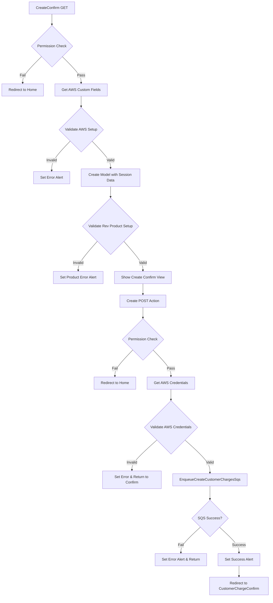
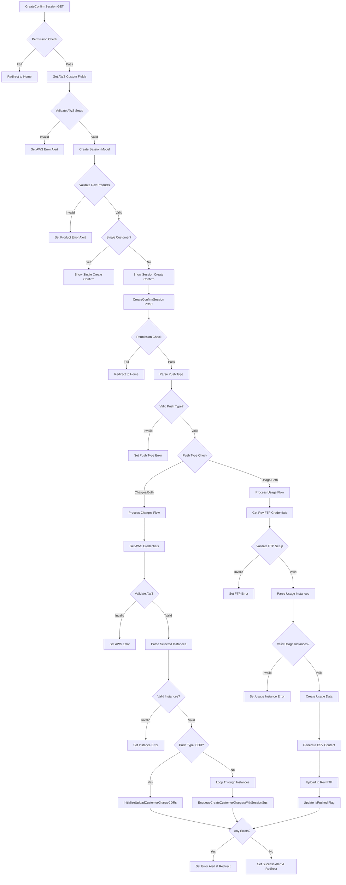
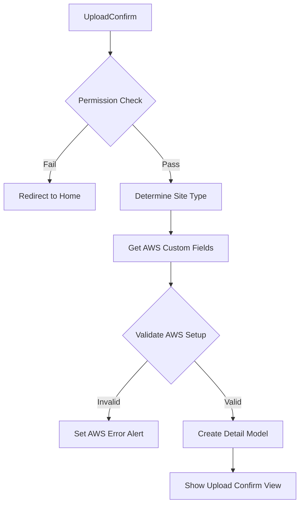
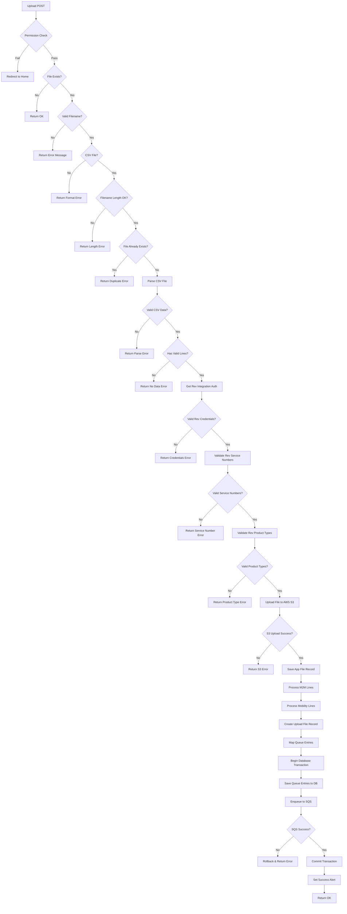

# CustomerChargeController Flow Documentation

## Overview
The CustomerChargeController handles two main workflows:
1. **Create Flow**: Creating customer charges for optimization sessions
2. **Upload Flow**: Uploading customer charge files (CSV) for processing

---

## 1. Create Customer Charges Flow

### 1.1 Single Instance Create Flow

### 1.2 Session-Based Create Flow

---

## 2. Upload Customer Charges Flow

### 2.1 Upload Confirmation Flow

### 2.2 File Upload Processing Flow

---

## 3. Key Components and Helper Methods

### 3.1 SQS Message Queuing

#### EnqueueCreateCustomerChargesSqs
- Creates SQS message for single instance processing
- Includes instance metadata and authentication details
- Returns success/error status

#### EnqueueCreateCustomerChargesWithSessionSqs
- Similar to above but with session-specific handling
- Includes delay for last instance (90 seconds)
- Handles multiple instance processing

#### EnqueueUploadCustomerChargeCDRs
- Processes CDR (Call Detail Record) customer charges
- Uses retry policy for reliability
- Handles portal type differentiation

### 3.2 File Processing

#### CSV Validation Steps:
1. File format validation (.csv)
2. Filename uniqueness check
3. Content parsing with CsvHelper
4. Data validation (positive charges only)
5. Rev.IO service number validation
6. Product type validation

#### AWS S3 Integration:
1. Upload original file to S3
2. Store S3 reference in database
3. Use for audit and backup purposes

### 3.3 Database Operations

#### Transaction Flow:
1. Begin database transaction
2. Create queue entries for processing
3. Enqueue SQS messages
4. Commit on success or rollback on failure

#### Queue Entry Types:
- `OptimizationDeviceResult_CustomerChargeQueue` (M2M devices)
- `OptimizationMobilityDeviceResult_CustomerChargeQueue` (Mobility devices)

---

## 4. Error Handling

### Common Error Scenarios:
1. **Permission Errors**: User lacks required module access
2. **AWS Setup Errors**: Missing or invalid AWS credentials
3. **Rev.IO Setup Errors**: Missing product types or integration auth
4. **File Validation Errors**: Invalid format, duplicate names, parsing issues
5. **Database Errors**: Transaction failures, constraint violations
6. **SQS Errors**: Queue not found, message send failures
7. **FTP Errors**: Invalid credentials or connection issues

### Error Response Pattern:
- Set error message in session alert
- Set alert type to "danger"
- Redirect to appropriate view or return error response
- Log errors for debugging

---

## 5. Security and Permissions

### Required Permissions:
- **CustomerCharge Module**: Base access for all operations
- **RevCustomers Module**: Required for Rev.IO operations
- **M2M/Mobility Modules**: Required for device editing

### Site Type Logic:
- Defaults to Rev if user has RevCustomers access
- Falls back to AMOP if RevCustomers access denied
- Affects data filtering and processing logic

---

## 6. Integration Points

### External Systems:
1. **AWS SQS**: Message queuing for async processing
2. **AWS S3**: File storage and backup
3. **Rev.IO**: Customer billing integration
4. **Rev FTP**: Usage data upload
5. **Database**: Transaction management and data persistence

### Custom Fields Required:
- AWS Access Key
- AWS Secret Access Key
- Customer Charge Queue Name
- Create Customer Charge Queue Name
- S3 Bucket Name
- Rev FTP credentials (Host, Username, Password, Path)